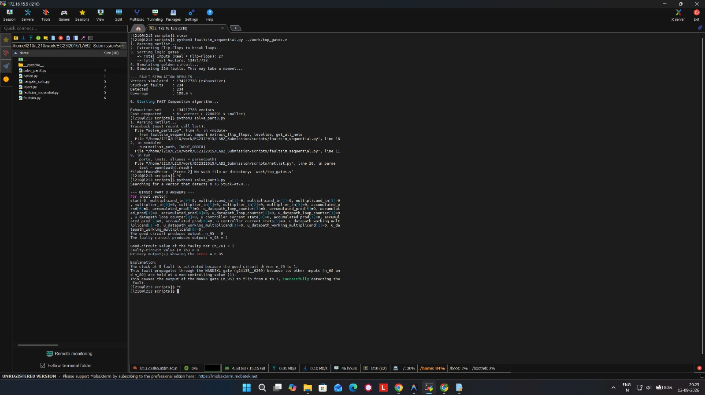

# Lab 2 / 4: Sequential Fault Simulation & Test Compaction

This repository contains a custom-built, bit-parallel sequential fault simulator written entirely in Python, designed to evaluate stuck-at faults in a synthesized Verilog gate-level netlist (using the Cadence Genus `slow_vdd1v0_basiccells` standard cell library).

## Features
- **Netlist Parsing & Scan-Chain Extraction**: Automatically parses Verilog netlists and extracts Flip-Flops to break combinational loops, treating them as Pseudo-Primary Inputs/Outputs (PPI/PPO).
- **Expanded Standard Cell Library**: Full mathematical definitions for complex logic gates (e.g., `AOI22`, `OAI31`, `MX2`, `CLKAND2`) directly mapped from Cadence Genus.
- **Bit-Parallel Simulation**: Uses Python's arbitrary-precision integers to simulate millions of test vectors (e.g., all 134,217,728 possible states for a 27-input circuit) simultaneously.
- **Greedy / Fast Compaction Algorithm**: Reduces exhaustive test vector sets down to the mathematical minimum required for 100% fault coverage on an ATE machine.

## Final Lab Report
📄 **[Download the Complete Lab Report (EC23I2015_Lab_2.pdf)](EC23I2015_Lab_2.pdf)**

## Results
Here is the complete output from the terminal, showing the 100% coverage, test compaction, and the exact vector trace for fault propagation on n_76:

